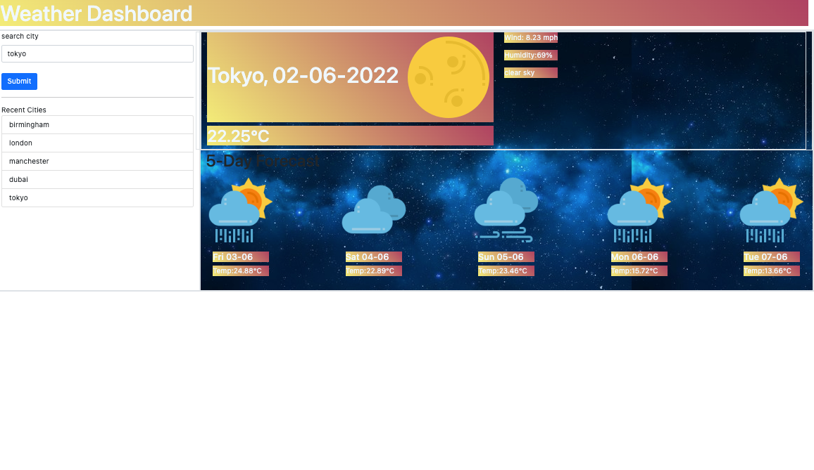

# weather-app

weather app using third party API

## Task

this Challenge is to build a Weather Dashboard App. This app will run in the browser and will feature dynamically updated HTML and CSS powered by JavaScript code. By using third-party API [OpenWeather One Call API](https://openweathermap.org/api/one-call-api) to retrieve weather data for cities, users can get real-time info on any city they want

## TODO

### Criteria

GIVEN a weather dashboard with form inputs
WHEN I search for a city
THEN I am presented with current and future conditions for that city and that city is added to the search history
WHEN I view current weather conditions for that city
THEN I am presented with the city name, the date, an icon representation of weather conditions, the temperature, the humidity, the wind speed, and the UV index
WHEN I view the UV index
THEN I am presented with a color that indicates whether the conditions are favorable, moderate, or severe
WHEN I view future weather conditions for that city
THEN I am presented with a 5-day forecast that displays the date, an icon representation of weather conditions, the temperature, the wind speed, and the humidity
WHEN I click on a city in the search history
THEN I am again presented with current and future conditions for that city

### User Journey

AS A traveler
I WANT to see the weather outlook for multiple cities
SO THAT I can plan a trip accordingly

## Deployed URL

Github repository: [here](https://github.com/awarsame1996/weather-app)
Live URL: [here](https://awarsame1996.github.io/weather-app/)

## Technologies

- HTML
- CSS
- GitHub Pages
- Javascript
- OpenWeatherAPI
- Bootstrap
- favicon
- JQuery
- ...more

## Screenshots

### Desktop Viewport



```

```
